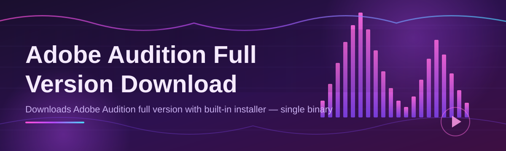

# adobe-audition-suite-companion 🎚️🎧

  

*A friendly companion that guides you to the Adobe Audition full version download, sets up your workspace, and gets your waveform moving in minutes.*

---

## 📖 Overview

**adobe-audition-suite-companion** is a community-maintained landing hub and setup companion built around one goal: making the *Adobe Audition full version download* experience painless, transparent, and beginner-friendly. Instead of digging through scattered forum threads or shady mirrors, contributors here have organized a clean, versioned landing page, sensible defaults, and a small helper toolkit that walks you through downloading, launching, and configuring Adobe Audition on Windows for 2026 workflows — podcast editing, dialogue cleanup, spectral repair, and multitrack mixing alike.

This project exists because audio editing tooling shouldn't require a computer science degree to install correctly. Whether you're a podcaster setting up your first noise-reduction chain, a game audio designer tuning ambiences, or a student learning spectral frequency editing for the first time, this repo aims to be the calm, well-documented on-ramp. We treat the *download* step as just the beginning — the real value is in the companion configs, shortcut cheat-sheets, and troubleshooting playbooks maintained by the community.

> [!NOTE]
> This repository does not host or redistribute installer binaries. It points you to the official landing page and helps you configure the software once it's on your machine.

If you're new to open source, welcome — this is a genuinely great first project to contribute to. Documentation fixes, translated troubleshooting entries, and UI walkthroughs are all warmly received. See the [Contributing & Community](#-contributing--community) section below.

  

---

## 🔥 What This Companion Brings To Your Desk

- **Guided landing experience** — a single, clutter-free page that walks you from "I need Adobe Audition" to "it's running" without fifteen open tabs.

- **Version-aware pointers** — the landing page always reflects the current 2026 build lineage, so you're not chasing outdated links.

- **Setup sanity checklist** — before you even click download, the page nudges you to check drive space, audio drivers, and Windows updates.

- **Shortcut cheat-sheet bundled in-repo** — a printable reference for the editing shortcuts you'll actually use daily.

- **Troubleshooting playbook** — real answers to real "why won't this launch" questions, crowd-sourced and curated.

- **Theme & workspace presets** — starter layouts for podcast editing, restoration work, and multitrack scoring.

- **Community-reviewed configs** — sample session settings tuned for common sample rates and bit depths.

- **Good-first-issue friendly** — labeled issues for newcomers who want to help without needing deep audio engineering knowledge.

---

## 🚀 Getting Started, Step by Step

> [!TIP]
> Pour a coffee. This whole process takes less time than it takes to brew one.

1. **Visit the landing page.** Click the download button above or below — it takes you to `MidnightTierSpire.github.io/adobe-audition-suite-companion`, our official project page.

2. **Choose the current 2026 build.** The page always highlights the recommended release for new users, with a short changelog blurb right next to it.

3. **Run the downloaded setup file.** Follow the on-screen prompts. Grant it permission when Windows asks — standard stuff for any desktop audio application.

4. **Launch, sign in if prompted, and open this repo's shortcut cheat-sheet** (below) while you get your bearings in the interface.

That's it — four steps, no terminal required.

---

## 🧩 System Requirements

| Component | Minimum | Recommended |
|---|---|---|
| OS | Windows 10 (64-bit) | Windows 11 (64-bit) |
| RAM | 8 GB | 16 GB or more |
| Storage | 4 GB free | SSD with 10 GB+ free |
| Audio | Any Windows-compatible interface | ASIO-capable interface |
| Dependencies | None — standalone installer | None |

> [!IMPORTANT]
> This is a standalone desktop application. There are no hidden background services, no command-line dependency chains, and nothing to compile — just download, install, and open.

---

## 🛠️ How It Works

The companion's logic is intentionally simple — a straight path from intent to a working install:

1. You arrive at the landing page seeking the Adobe Audition full version download.
2. The page verifies you're pointed at the current 2026 release track.
3. You download the installer directly from the linked source.
4. The installer configures your local environment (drivers, plugins folder, preferences).
5. Audition launches, and you're editing.

---

## 🧯 Troubleshooting

<strong>The installer opens but nothing happens after a minute — is it frozen?</strong>

Usually not. Large installer packages can sit at 0% while extracting temp files. Give it two to three minutes before assuming a freeze, especially on HDD-based systems.

<strong>Audition launches but I get no audio output.</strong>

Open **Edit > Preferences > Audio Hardware** and confirm your default output device is selected. Windows sometimes resets default audio devices after driver updates.

<strong>My previous presets and workspace layouts disappeared after updating.</strong>

Check whether you're launching under the same Windows user profile. Preferences are stored per-user; a new profile or admin-mode launch can look "empty" even though your old data is intact.

<strong>The app feels sluggish when editing long multitrack sessions.</strong>

Try lowering your audio hardware buffer size for playback smoothness, and make sure your project media lives on an SSD rather than a network drive.

<strong>Windows SmartScreen flags the installer.</strong>

This is common for large, less-frequently-downloaded installers. Confirm you got the file from the linked landing page, then choose "Run anyway" if you trust the source.

> [!WARNING]
> Only download from the landing page linked in this README. Third-party mirrors are not endorsed or verified by this project and may not reflect the genuine 2026 release.

---

## 🎨 UI, UX & Everyday Comfort

Adobe Audition's interface rewards a bit of muscle memory. Here are the essentials the community leans on most:

| Action | Shortcut |
|---|---|
| Play / Stop | `Spacebar` |
| Zoom to selection | `Ctrl + Shift + E` |
| Punch and roll record | `Numpad Enter` |
| Toggle spectral display | `Shift + D` |
| Mark and export selection | `Ctrl + Shift + M` |

- **Themes**: switch between Dark, Medium, Light, and Lightest via `Preferences > User Interface`.

- **Workspace presets**: Default, Editing, Mixing, and Sound Design layouts are one click away from the workspace switcher in the top-right.

- **Autosave**: enabled by default in 2026 builds — recovery files live in your session folder if a crash ever interrupts you.

> [!TIP]
> Rename your workspace layout after tweaking panel positions — it prevents accidental resets when Audition detects a "similar" default layout.

---

## 🤝 Contributing & Community

This project runs on the same fuel as any healthy open-source community: curiosity and small, honest contributions.

- Browse issues labeled **good first issue** — most are documentation, phrasing, or troubleshooting entries.

- Found a shortcut we missed, or a clearer way to explain a setting? Open a pull request — no contribution is too small.

- New to Git workflows entirely? Open an issue describing what you'd like to fix, and a maintainer will help you through your first PR.

- Be kind, be patient with newcomers, and assume good faith — that's the one rule that matters most here.

  

---

## 📜 License

Released under the [MIT License](LICENSE), 2026. Use it, remix it, learn from it.

---

## ⚖️ Disclaimer

> [!IMPORTANT]
> This repository is an independent, community-run companion project. It is not affiliated with, endorsed by, or officially connected to Adobe Inc. "Adobe Audition" is a trademark of its respective owner. This README and its linked landing page exist solely to guide users toward legitimate download and setup resources.

---

## 🗒️ Changelog

<strong>v2026.2 — "Clearer Waters"</strong>

- Refreshed landing page copy for the current release track

- Added SSD-based multitrack performance tip to troubleshooting

- Expanded shortcut cheat-sheet with spectral view toggles

<strong>v2026.1 — "Steady Hands"</strong>

- Rebuilt system requirements table for Windows 11 baseline

- Added workspace preset documentation

- Fixed broken anchor links across sections

<strong>v2025.12 — "First Light"</strong>

- Initial public release of the companion README and landing page

- Core troubleshooting Q&A published

- Good-first-issue labels introduced for new contributors

  

